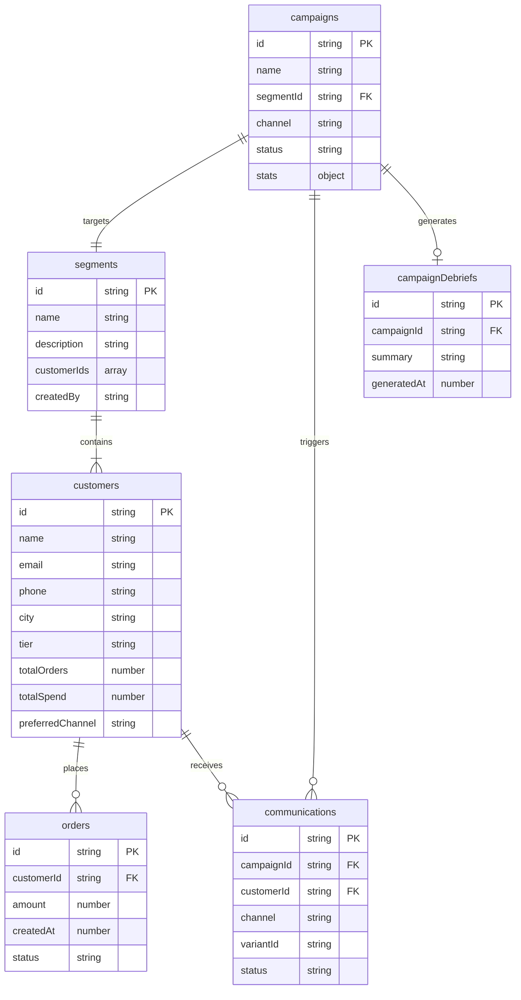
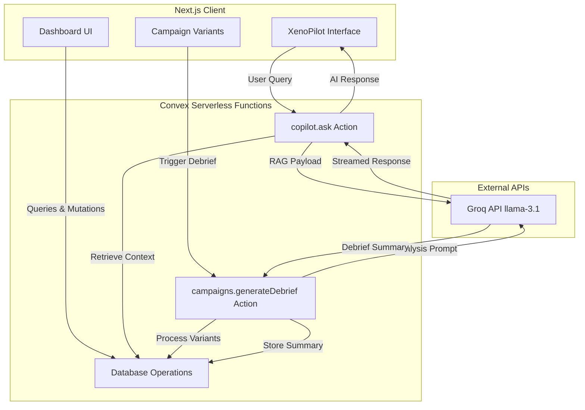

# XenoPulse CRM

XenoPulse is a highly polished, AI-native campaign intelligence platform and dashboard built for internal use. It provides real-time analytics, variant testing capabilities, automated debriefs for marketing campaigns, and an intelligent copilot designed to interact directly with CRM data.

## Key Features Checklist

- [x] **Authentication Flow**
  - Custom-animated authentication spinner utilizing Framer Motion.
  - Secure employee authentication simulation.
  - Sleek, monochromatic login screen.

- [x] **Campaign Intelligence Dashboard**
  - **Live Stat Cards**: Visualize total customers, total spend, and trends with interactive sparkline charts.
  - **Raw Webhook Terminal**: A visually striking, animated terminal feed demonstrating real-time ingestion of conversion webhooks (opens, clicks, conversions).
  - **Variant Testing (A/B/n)**: Visualizes A/B testing results with animated progress bars indicating conversion rates and open rates.
  - **Automated AI Debriefs**: Integrates an LLM-powered "Generate Debrief" feature that processes campaign variants and outputs a statistical summary of the best-performing strategies.
  - **Winner Highlighting**: Automatically calculates and visually isolates the winning variant in a test based on maximum conversion metrics.

- [x] **XenoPilot (AI CRM Assistant)**
  - Fully integrated, Notion-style AI assistant (`XenoPilot`).
  - **RAG Architecture**: Fetches live context from the Convex database (active campaigns, customer segments, stats) and securely injects it into the LLM context.
  - Powered by **Groq API** (`llama-3.1-8b-instant`) for highly intelligent responses.
  - Minimalist geometric mascot and monochrome UI for a premium enterprise feel.

- [x] **Global Navigation & Mobile Responsiveness**
  - **Command Menu (Cmd+K)**: Fully keyboard-accessible global search interface for rapid navigation.
  - **Mobile-First Layout**: Fully responsive off-canvas mobile sidebar with hamburger menu integration.
  - Grid layouts, tables, and the XenoPilot chat interface seamlessly adapt to mobile screens.

- [x] **Design System & Aesthetics**
  - Strict dark mode design system (`#050505` background).
  - Accented by Xeno's signature deep purple (`#6633cc`) and violet (`#a78bfa`) gradients.
  - **Outfit** font family (Google Fonts) used exclusively for a geometric, premium appearance.
  - Extensive use of `framer-motion` for micro-interactions and smooth layout transitions.

## Architecture and Technologies

The application is built on a modern React stack:

*   **Frontend**: Next.js 15 (App Router, Server Components where applicable)
*   **Backend**: Convex (Real-time backend-as-a-service with built-in TypeScript schema validation)
*   **AI Engine**: Groq API (`llama-3.1-8b-instant`)
*   **Styling**: Tailwind CSS v4
*   **Animations**: Framer Motion
*   **Icons**: Lucide React
*   **Alerts/Notifications**: Sonner

## Database Schema (Convex ERD)

Below is the Entity Relationship Diagram representing the core Convex database schema utilized by XenoPulse.



## System Architecture

The following diagram illustrates how the Next.js frontend interacts with the Convex backend and external APIs like Groq for AI functionality.



## Setup and Installation

1.  **Install Dependencies**
    Execute the following command to install all required Node modules:
    ```bash
    npm install
    ```

2.  **Environment Variables**
    Add the necessary Convex keys to your `.env.local` for local development.
    To enable the AI features (Variant Generation, Debriefs, and XenoPilot), you must add your `GROQ_API_KEY` to the **Convex Dashboard** under Settings > Environment Variables.

3.  **Start Convex Backend**
    Initialize the real-time database and serverless functions:
    ```bash
    npx convex dev
    ```

4.  **Start Next.js Frontend**
    Run the Next.js local development server:
    ```bash
    npm run dev
    ```
    Access the application at `http://localhost:3000`.

## Deployment

This application is configured for seamless deployment to **Vercel**. Simply push to the `main` branch, ensure your `NEXT_PUBLIC_CONVEX_URL` is set in Vercel's environment variables, and the `GROQ_API_KEY` is configured in your production Convex deployment.
